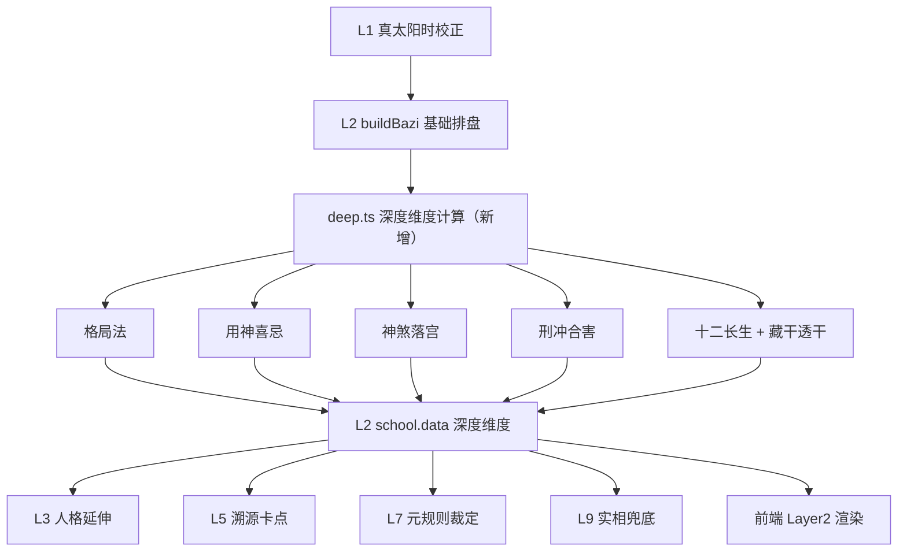

# L2 深度命理分析维度 技术设计

Feature Name: l2-deep-analysis
Updated: 2026-08-08

## Description

在现有 L2「术数算力池」之上新增一组确定性「深度术数维度」。所有规则为纯函数、同输入同输出，可被 verify 回归与前端直接消费。维度以「倾向性参考」语言呈现，延续系统祛魅定位。

## Architecture



## Components and Interfaces

### 新增模块 `src/modules/l2/deep.ts`

纯函数集合，输入 `BaziResult`，输出深度维度结构：

```ts
export interface DeepAnalysis {
  geju: GeJuResult;          // 格局法
  yongShen: YongShenResult;  // 用神喜忌
  shenSha: ShenShaResult[];  // 神煞落宫
  xingChong: XingChongResult[]; // 地支刑冲合害
  shiErChangSheng: ShiErChangShengResult; // 十二长生
  touGan: TouGanResult[];    // 藏干透干
}

export function runDeepAnalysis(bazi: BaziResult): DeepAnalysis;
```

#### 格局法 `resolveGeJu`

- 取月支藏干首位（本气）为候选格神；计算其相对日主的十神。
- 若四柱天干出现月支藏干中任意一个，选天干出现的（按藏干顺序优先）为「透干成格」。
- 若月支为日主临官（建禄）或羊刃位，判为建禄格/羊刃格（不取十神格）。
- 输出：`{ name, mainShiShen, transGan, note }`。

#### 用神喜忌 `resolveYongShen`

- 扶抑法：依据 `bazi.strength`（偏旺/中和/偏弱）取用神十神组：
  - 偏旺 → 克泄耗（官杀/食伤/财）
  - 偏弱 → 生扶（印/比劫）
  - 中和 → 取通关或调候，标注「中和取调候」
- 调候法：按日干五行 × 出生月支季节（冬/夏/春/秋）查简表：
  - 冬（亥子丑）：火调候暖局
  - 夏（巳午未）：水调候润局
  - 春/秋：视日干五行取本气平衡
- 喜神：生助用神者；忌神：克耗用神者（按五行相生克简化）。
- 输出：`{ method, yong, xi, ji, tiaoHou, note }`（五行维度）。

#### 神煞落宫 `resolveShenSha`

确定性规则表（全部以日干/日支推算，只报告落入四柱者）：

| 神煞 | 规则（传统口诀） | 落宫字 |
|------|------------------|--------|
| 天乙贵人 | 甲戊庚牛羊；乙己鼠猴乡；丙丁猪鸡位；壬癸兔蛇藏；六辛逢马虎 | 特定地支 |
| 桃花(咸池) | 申子辰见酉、寅午戌见卯、巳酉丑见午、亥卯未见子 | 对应地支 |
| 驿马 | 申子辰马在寅、寅午戌马在申、巳酉丑马在亥、亥卯未马在巳 | 对应地支 |
| 华盖 | 申子辰见辰、寅午戌见戌、巳酉丑见丑、亥卯未见未 | 对应地支 |
| 将星 | 申子辰见子、寅午戌见午、巳酉丑见酉、亥卯未见卯 | 对应地支 |
| 禄神 | 甲寅乙卯丙巳丁午戊巳己午庚申辛酉壬亥癸子 | 对应地支 |
| 羊刃 | 甲卯乙辰丙午戊午己未庚酉辛戌壬子癸丑 | 对应地支 |

- 输出：`{ name, position(年月日时), zi }[]`，仅含落入四柱者。

#### 刑冲合害 `resolveXingChong`

- 对四柱地支两两配对（C(4,2)=6 组）判定：
  - 六冲：子午、丑未、寅申、卯酉、辰戌、巳亥
  - 六合：子丑、寅亥、卯戌、辰酉、巳申、午未
  - 三合：申子辰、亥卯未、寅午戌、巳酉丑（需三支齐）
  - 三刑：寅巳申（无恩）、丑戌未（恃势）、子卯（无礼）、辰午酉亥（自刑）
  - 六害：子未、丑午、寅巳、卯辰、申亥、酉戌
- 输出：`{ type, a(柱位+支), b(柱位+支) }[]`。

#### 十二长生 `resolveShiErChangSheng`

- 日主在四柱支 + 当前大运支的 `dishi`（lunar 已算），结构化输出。
- 归类倾向：长生/临官/帝旺 →「得地」；衰/病/死/墓 →「需养」；其余「平稳」。

#### 藏干透干 `resolveTouGan`

- 各柱藏干列表（本气/中气/余气），若出现在四柱任意天干 → `tou=true`。
- 输出：`{ position, hideGan: string[], tou: string[] }`。

### L2 输出增强

`runL2` 中 `schools[0].data` 追加：

```ts
deep: { geju, yongShen, shenSha, xingChong, shiErChangSheng, touGan }
```

`schools[0].note` 版本 V1 → V2，注明「含格局/用神/神煞/刑冲合害/十二长生深度维度」。

### 上层消费（text 注入）

- **L3 人格**：`strengths` 描述追加一句「传统用神（五行X）提示的方向」倾向说明。
- **L5 因果溯源**：新增一条 `karmaPatterns`（若存在刑冲/六害），名「地支互动」。
- **L7 元规则**：裁定说明追加「以格局（X格）为辅」。
- **L9 实相兜底**：`essence` 或建议区追加用神/调候收束一句。

### 前端

- `pages/report/layers.tsx` `Layer2` 渲染新增区块：格局、用神喜忌、神煞、刑冲合害、十二长生、藏干透干。
- `pages/report/exportText.ts` 在 L2 段落增加上述区块文本。
- 后端 `L2Result` 类型（client.ts）追加 `deep` 字段（可选，向后兼容旧记录）。

## Data Models

`DeepAnalysis` 结构见上。为向后兼容：`deep` 字段可选（`deep?: ...`），旧记录 report 中不存在时不渲染新区块、不报错。

## Correctness Properties

- 确定性：同四柱同输入必得同输出（纯函数，无随机、无时间依赖）。
- 透干优先于月支本气成格；建禄/羊刃格优先级最高。
- 神煞只报告落入四柱者，不得外推至大运。
- 调候简表按季节覆盖全部 12 月支，无遗漏分支。
- 所有文案含倾向性/祛魅措辞，不输出绝对吉凶断言。

## Error Handling

- `timeKnown=false`（仅日柱精度）时：时柱地支参与计算但不强判时柱神煞/长生，输出仍可用，note 降置信度。
- 无法确定某维度（如调候表外日干）时：该子项置空串/空数组，文案「信息不足，仅供参考」，不抛错。

## Test Strategy

- verify_l2：新增断言覆盖主用例（2002-11-29 20:40 北京 女，日主辛）：
  - 格局 = 伤官格（月令亥本气壬 → 伤官）
  - 用神五行含「水/火调候」、忌神含「土」
  - 神煞数组含「天乙贵人/桃花/驿马」中实际落入者
  - 刑冲合害与十二长生结构完整性
- verify_all：九层 report 中 L2 深度维度存在性。
- web：Layer2 渲染新维度、exportText 含格局/用神文本；client L2Result.deep 类型向后兼容（旧数据不渲染）。

## References

[^1]: lunar-javascript 官方文档 - 藏干/十神/十二长生/胎元命宫/大运流年 API（https://github.com/6tail/lunar-javascript）
[^2]: 八字命理学派综述 - 格局派/旺衰派/神煞/调候/刑冲合害方法体系（研几百科、神策网等网络资料汇总）
